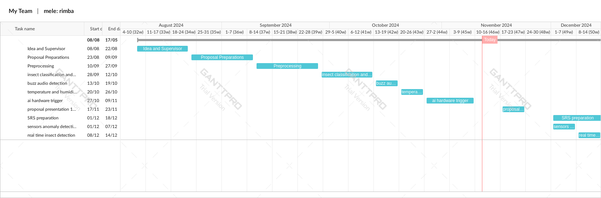
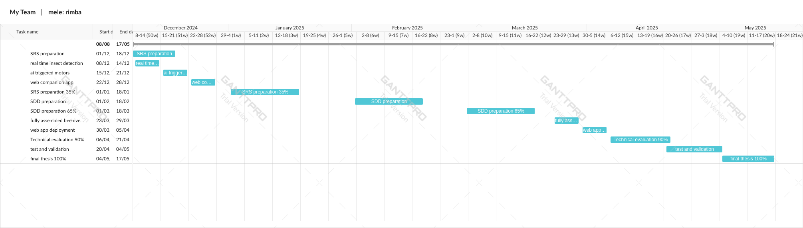

# Mele: Real-time IoT Monitoring for Beehives and Apiaries

Welcome to Mele, an IoT-based Smart Beehive Monitoring System. This project integrates artificial intelligence and IoT technologies to enhance beekeeping practices, ensuring optimal hive conditions and bee health. Below, you'll find the main features, setup instructions, and resources for getting started.

## Project Overview

Mele (derived from the Italian word for "honey") is designed to assist beekeepers in monitoring beehive health through real-time data analysis and predictive maintenance. The system includes:

- **Temperature and Humidity Monitoring**: Forecasts conditions inside and outside the hive, activating climate control measures as needed.
- **Honey Yield Tracking**: Uses camera sensors and weight tracking to provide insights into honey readiness.
- **Bee Population Monitoring and Behavioral Analysis**: Tracks hive population and identifies pests or anomalies.
- **Threat Detection and Mitigation**: Identifies potential threats, including wasps and environmental hazards, taking automatic preventive actions when necessary.

## Features

- **Eco-Friendly Design**: Powered by a solar grid, promoting sustainability.
- **Real-Time AI-Based Monitoring**: AI models trained for insect recognition, disease detection, and anomaly detection.
- **Remote Access**: Allows beekeepers to monitor and control hive status remotely.
- **Modular and Upgradable**: Compatible with common hive designs (e.g., Langstroth hives) and adaptable to various configurations.

## Getting Started

1. **Install Dependencies**  
   Ensure all required software packages and hardware modules are installed. See [requirements.txt](path/to/requirements.txt) for more details.

2. **Hardware Setup**  
   - Attach temperature, humidity, weight, and gas sensors to the hive.
   - Position cameras and microphones at key hive entrances to monitor activity and capture audio for threat detection.

3. **Software Setup**  
   - Clone the repository and install dependencies.
   - Run the AI models for insect classification, temperature forecasting, and anomaly detection.
   - Configure the system’s remote monitoring platform for alerts and data visualization.

4. **Testing and Calibration**  
   Use the testing scripts to verify sensor functionality and calibrate the AI models for specific hive environments. Regularly monitor data logs to ensure accurate readings.

## System Architecture

## Project Management

Project milestones and deliverables are outlined in the Gantt chart, detailing timelines for development, testing, and deployment phases. 

## Datasets

- **Insect Classification**: Consists of labeled images of bees, wasps, and other insects.
- **Honeycomb Supers**: A dataset to differentiate between capped and uncapped cells for yield tracking.
- **Audio Buzzing Data**: Audio clips labeled with bee and wasp sounds to train acoustic detection models.

## Acknowledgments

This project is supervised by Dr. Walaa Hassan and Eng. Hamsa Mahmoud and is supported by the "Al-Badran" beekeeping group. 

